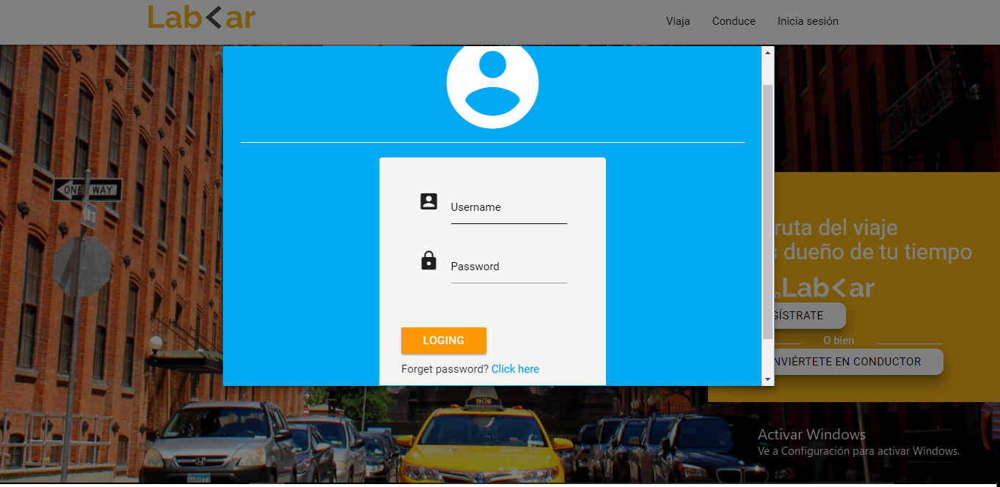
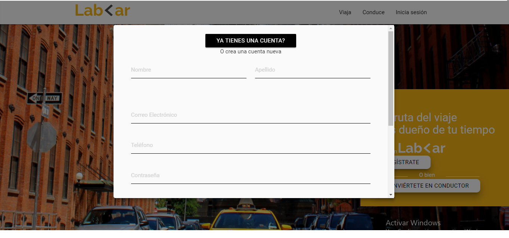
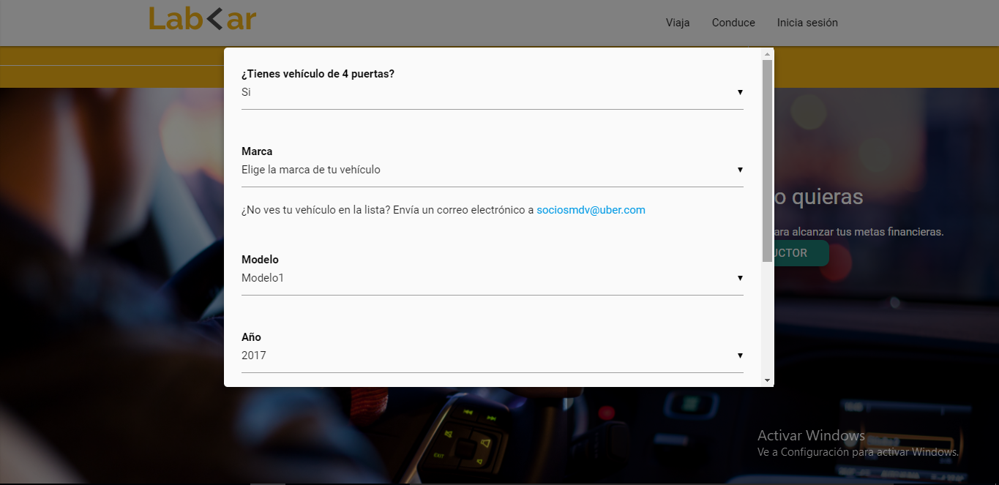

# Reto LabCar
## OBJETIVO
Recrear la página LabCar usando el framework `materialize` para las versiones: desktop y mobile first. Y también agregar modales.
## Herramientas
* Html5
* Css3
* Js
* jQuery
* Materialize

# Modales
* Modal de Inicia Sesión
***

* Modal de Regístrate
***

* Modal de Convierte en conductor
***

